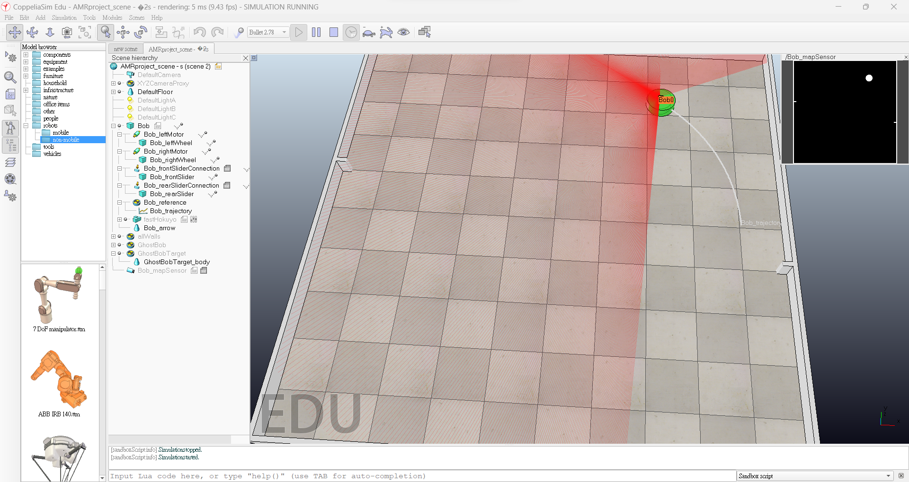
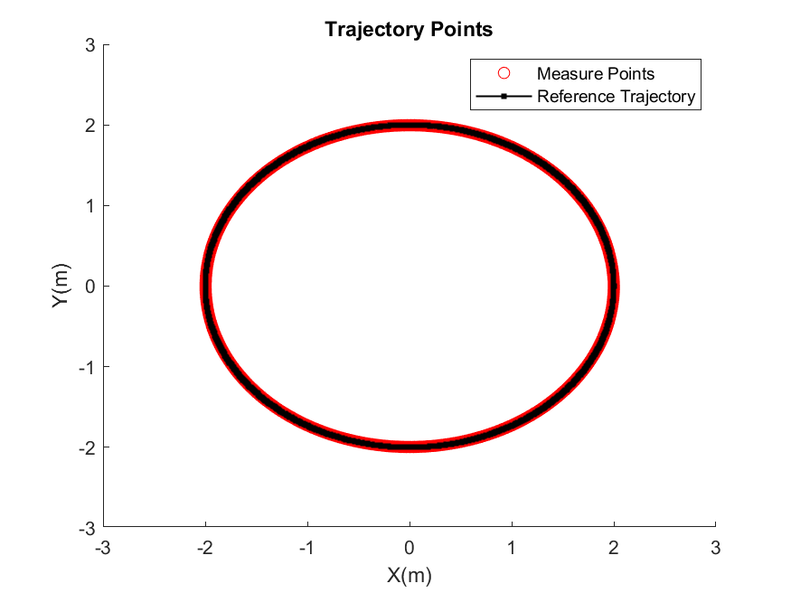
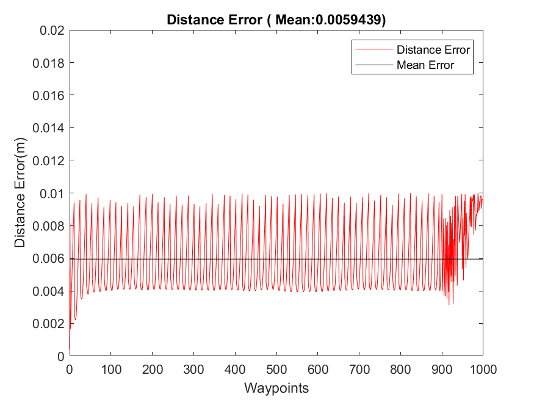
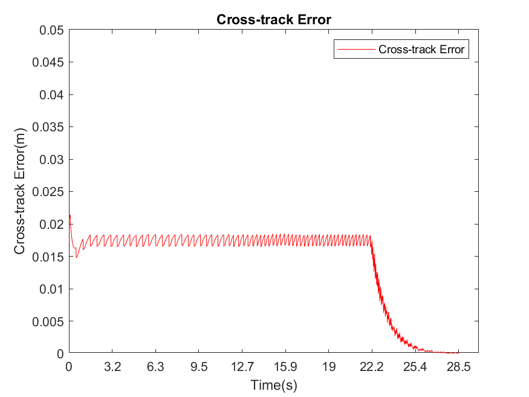

# Closed-Loop Differential Drive Mobile Robot Trajectory Tracking Based on Waypoint Method
 
## Descriptions
The project is about ***Waypoin Control***, a method of trajectory tracking, on a closed-loop differential drive mobile robot. We simulated the robot and the trajectory results using MATLAB and CoppliaSim.

## Tools
MATLAB, CoppeliaSim

## Methods

## Results

